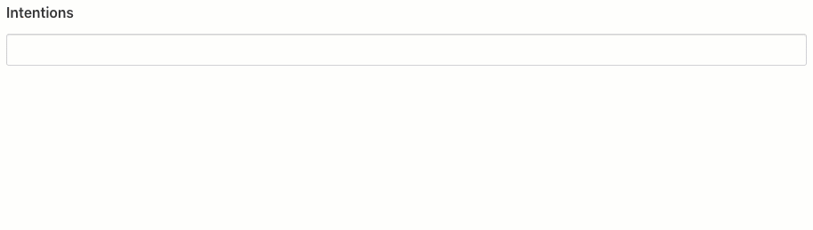
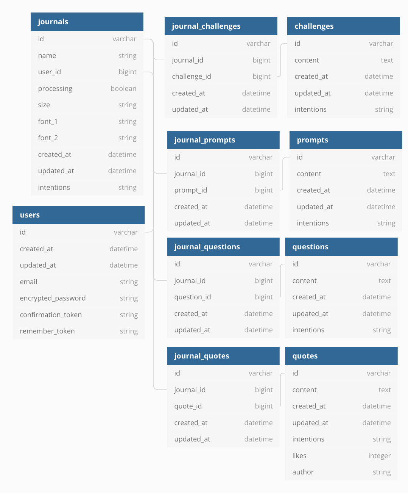

<p align="center"></img></p>

# DailyPager Walkthrough

> Create a journal based on your intentions for the year ahead. 

I’d used all kinds of journals, but didn’t want to be stuck to one methodology. So I made dailypager.

You can choose from a selection of intentions for the year ahead and a printable journal will be created for you. Including relevant quotes, challenges, questions and prompts.



## Live version

https://www.dailypager.com
Credential: demo@example.com / hello123

Hosted on Digital Ocean with Dokkku.

## Technology Used

- Ruby on Rails 6
- AWS S3 for PDF file storage in production
- Postgresql

## Notable Gems

- prawn for pdf generation
- pdf-inspector for testing PDF output
- acts-as-taggable-array-on for fast tagging using postgresql array columns
- clearance for authentication

## Tests


## Database Diagram



## User Stories
 
### As a User

- I want to signup
- I want to create a journal PDF I can print at home
- I want to download my Journal PDF
- I want to create a journal PDF in two sizes "personal" and "A5"
- I want to create a journal PDF based on up to 5 different intentions I have for the year ahead
- I want each page of my journal PDF to be different
- I want to customise the font of my journal PDF
- I want to edit my intentions to create a new journal PDF
- I want to save my created journal PDF on my account
- I want to be able to buy printed journal pages ready to use

## Design Decisions

The structure of the app is made from a series of many-to-many relationships to the main "Journal" class.

As you can see in the database diagram. Each Journal has for example many "quotes" through the "journal_quotes" table.

The "quotes" table contains 5,000 quotes tagged with various intentions such as "gratitude". When the user selects
gratitude as an intention, the correct number of tagged quotes are selected at random and associated with that users journal.

You can see that logic below from the Quote model.

```ruby
def self.block(intentions, journal)
  quotes_array = []
  intentions.each do |intention|
    quotes = self.with_any_intentions(intention).random.limit(40)
    quotes.each do |quote|
      q = { quote_id: quote.id, 
		journal_id: journal.id,
		created_at: Time.now,
		updated_at: Time.now }
      quotes_array << q
    end
  end
  JournalQuote.insert_all(quotes_array)
end
```

You can run this class method like so in the rails console `Quote.block(["gratitude"], journal)` and it will manually create
the associations for a given journal.

`random` above is actually a rails scope that calls `order(Arel::Nodes::NamedFunction.new('RANDOM', []))`.
You can see this when you look at the model in more detail [here](app/models/quote.rb). Retrieving 40 quotes per
intention passed.

### Avoiding N+1 Database Queries

Also here you can see the `insert_all` method, which allows a drastic reduction on database queries by passing
a hash of all the journal_quotes associations in one query.

This was refactored from `journal_quotes.create!(journal: journal)` being called for each new association. 


