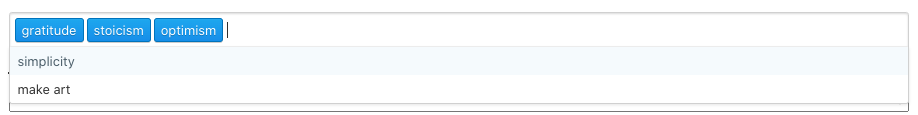
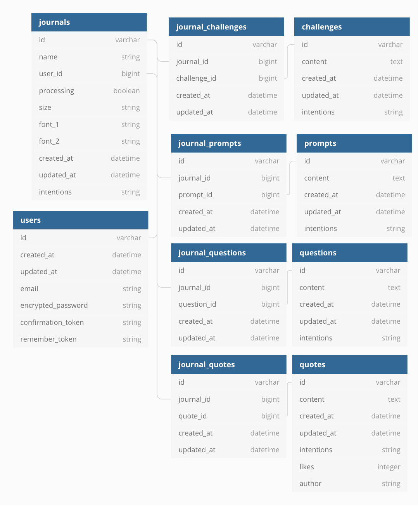

</img>

# Basic Overview

This repo is summary of the project including the most important building blocks.

Create a customised printable journal based around up to 5 of your intentions for the year ahead, for example Stoicism, Gratitude & Simplicity.

Using relevant quotes, prompts, questions and challenges a custom journal will be built around you.

Daily pager allows you to create the perfect journal built around your intentions. I’ve heard of and tried all kinds of journals, but don’t want to be stuck to one methodology. Enter daily pager.
Choose from a selection of intentions for your year ahead and your journal will be created for you. Including inspiring quotes, challenges, questions and prompts.

# Live version

https://www.dailypager.com/sign_up
any email and password combination works e.g. hello@example.com / qwerty

Hosted using Dokku with Digital Ocean VPS.

# Technology

- Ruby on Rails 6
- AWS S3 for PDF file storage in production
- Postgresql

# Database Diagram

## Notable Gems
- prawn for pdf generation
- pdf-inspector for testing PDF output
- acts-as-taggable-array-on for fast tagging using postgresql array columns
- clearance for authentication

## User Stories
 
### As a User

- I want to signup
- I want to create a journal PDF I can print at home
- I want to download my Journal PDF
- I want to create a journal PDF in two sizes "personal" and "A5"
- I want to create a journal PDF based on up to 5 different intentions I have for the year ahead
- I want each page of my journal PDF to be different
- I want to customise the font of my journal PDF
- I want to edit my intentions to create a new journal PDF
- I want to save my created journal PDF on my account
- I want to be able to buy printed journal pages ready to use

