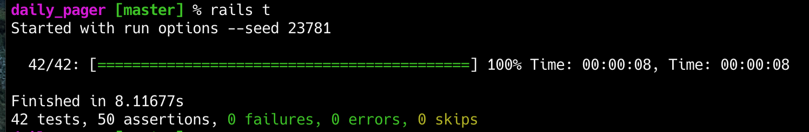
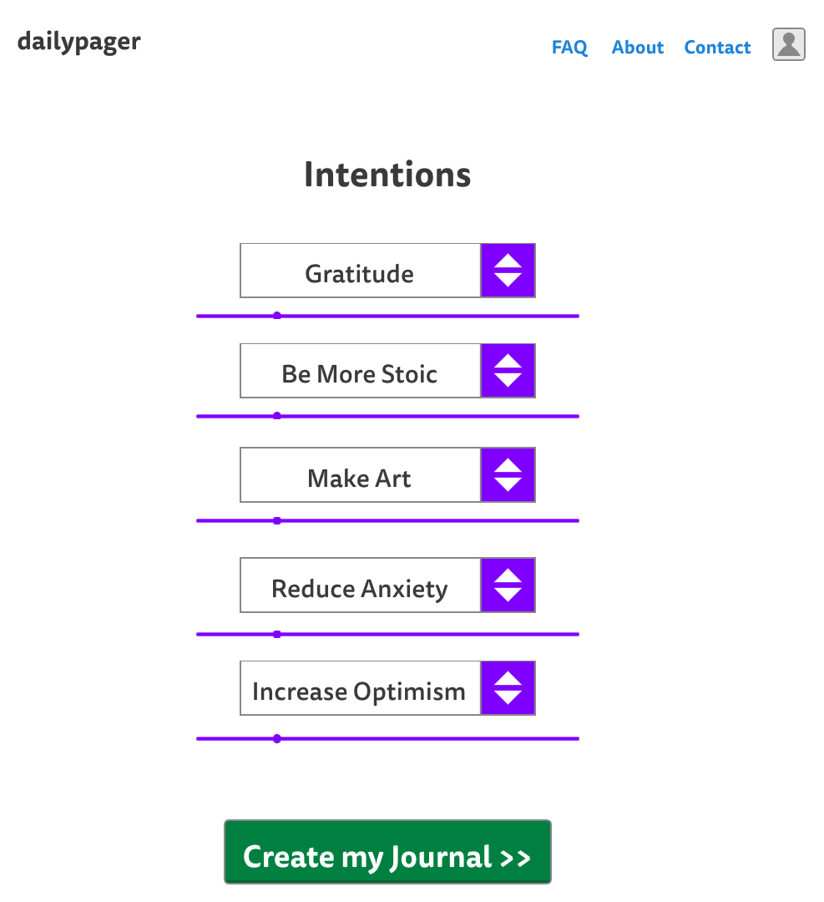
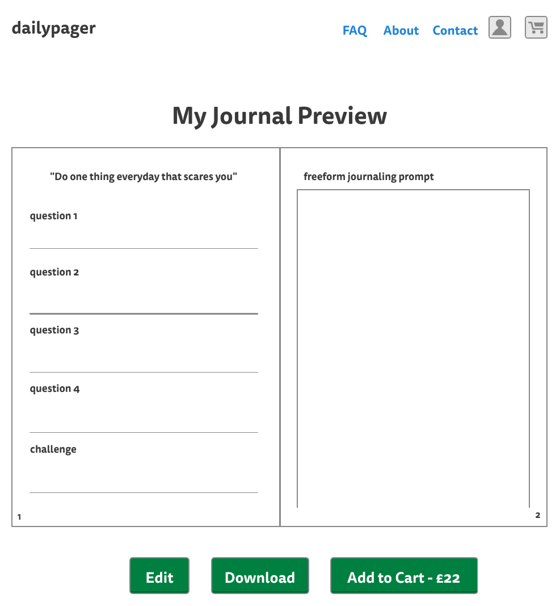
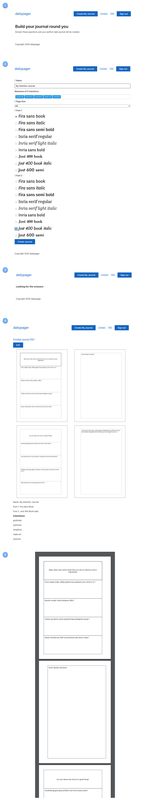

<p align="center"></img></p>

# Project Walkthrough

> Create a journal based on your intentions for the year ahead. 

Choose from a selection of intentions for the year ahead and a printable journal will be created for you based around them.
Including relevant quotes, challenges, questions and prompts.


## Live version

https://dailypager.com
Login with: demo@example.com / hello123

Hosted on a Linode VPS using [Dokkku](http://dokku.viewdocs.io/dokku/).

## Technology Used

- Ruby on Rails 6
- Ruby compiled and deployed with [jemalloc](https://bit.ly/3oddFEk) for reduced memory usage on low ram VPS 
- AWS S3 for PDF file storage in production
- Postgresql 
- Redis with [Sidekiq](https://github.com/mperham/sidekiq) for pdf generation in background jobs

## Notable Gems

- [prawn](https://github.com/prawnpdf/prawn) for pdf generation
- [pdf-inspector](https://github.com/prawnpdf/pdf-inspector) for testing PDF output
- [acts-as-taggable-array-on](https://github.com/tmiyamon/acts-as-taggable-array-on) for fast tagging using postgresql array columns
- [mini-magick](https://github.com/minimagick/minimagick) for in browser PDF previews
- [clearance](https://github.com/thoughtbot/clearance) for authentication

## Tests

Currently sitting with 42 unit tests that ensure the basic functionality is robust.

These tests include checking that content passed to the PDF actually appears once it
is generated using pdf-inspector.



## Database Diagram


## Design Decisions

### The Template Design Pattern

The app uses the template design pattern to create a base PDF with custom fonts, font_sizes and page size properties with the `TemplatePdfx` class.

Then when generating an actual Journal PDF, this inherits the template and creates the actual page content with the `JournalTemplatePdf` class.

This logic would extend nicely to make additional journal content in a modular way such as habit trackers or other optional user selected extras.

[Go here](pdfs/) to see how the PDFs are created using this pattern.

### Journal Content

The structure of the app is built up from a series of many-to-many relationships to the main "Journal" class.

As you can see in the database diagram. Each Journal has for example many "quotes" through the "journal_quotes" table. 
This is then repeated for each different type of content, like "prompts".

The "quotes" table contains 5,000 quotes tagged with various intentions such as "gratitude". When the user selects
gratitude as an intention, the correct number of tagged quotes are selected at random and associated with that users journal.

You can see that logic below from the Quote model.

```ruby
# can take multiple intentions and create a question block
# associated to the given journal
def self.block(intentions, journal)
  quotes_array = []
  intentions.each do |intention|
    quotes = self.with_any_intentions(intention).random.limit(40)
    quotes.each do |quote|
      q = { quote_id: quote.id, 
		journal_id: journal.id,
		created_at: Time.now,
		updated_at: Time.now }
      quotes_array << q
    end
  end
  JournalQuote.insert_all(quotes_array)
end
```

You can run this class method like so in the rails console `Quote.block(["gratitude"], journal)` and it will manually create
the associations for a given journal.

`random` above is actually a rails scope that calls `order(Arel::Nodes::NamedFunction.new('RANDOM', []))`.
You can see this when you look at the model in more detail [here](app/models/quote.rb). Retrieving 40 quotes per
intention passed.

### Avoiding N+1 Database Queries

Also here you can see the `insert_all` method, which allows a drastic reduction on database queries by passing
a hash of all the journal_quotes associations in one query.

This was refactored from `journal_quotes.create!(journal: journal)` being called for each new association.

Also an in memory cache is used to store the journal content for later use when creating the PDF, you can see this logic
inside the journal model for exammple. This also reduces database queries a great deal.

```ruby
def cached_quotes
Rails.cache.fetch([self, "journal_quotes"]) { quotes.to_a }
end
```

### Background Jobs

As creating a 183 page PDF can take some time, especially in prodcution when saving to Amazon S3,
this work is passed over to a background job using Sidekiq and Redis.

During this job, this is what happens step-by-step.

1. Journal is found and the processing column is set to true
2. All journal content is gathered and associated with the current Journal
3. The Journal object is passed to the JournalTemplatePdf class for PDF creation
4. The resulting PDF is saved temporarily to the local filesystem
5. The temporary PDF has a preview 4-page spread created and also stored temporarily
6. The temporary PDF and preview image are uploaded to Amazon S3 (temp files then deleted)
7. Journal is set to processing: false and saved

This process takes around 5.5 seconds.

```ruby
class GenerateJournal
include Sidekiq::Worker
sidekiq_options retry: :false

def perform(journal_id)
  journal = Journal.find(journal_id)
  journal.update_column(:processing, true)
  intentions = journal.intentions
  Question.block(intentions, journal)
  Prompt.block(intentions, journal)
  Quote.block(intentions, journal)
  Challenge.block(intentions, journal)
  pdf = JournalTemplatePdf.new(journal)
  pdf.output_journal

  # Save to tmp file
  # ===
  source_file_name = "pdf_journal_#{(journal_id).to_s}"
  source_file_path = File.join(Dir.tmpdir, "#{source_file_name}-#{Time.now.strftime("%Y%m%d")}-#{$$}-#{rand(0x100000000).to_s(36)}-.pdf")
  pdf.render_file source_file_path
  journal.journal_pdf.attach(io: File.open(source_file_path), 
			     filename: "#{journal.size}_#{journal.name.gsub(/\s+/, "")}_#{journal.id}.pdf", 
			     content_type: "application/pdf")

  # Convert PDF with minimagick
  # ===

  # set filename to start with  "journal_id"
  destination_file_name = "journal_#{(journal_id).to_s}"

  # set path for tempfile that is about to be created
  converted_file_path = File.join(Dir.tmpdir, "#{destination_file_name}-#{Time.now.strftime("%Y%m%d")}-#{$$}-#{rand(0x100000000).to_s(36)}-.png")

  # Save first two pages as one PNG in landscape e.g (page 1 | page 2)
  MiniMagick::Tool::Montage.new do |montage|

    montage.density "300"
    montage.quality "80"
    montage.interlace "Plane"
    montage.strip
    montage.bordercolor "Black"
    montage.border "1"
    montage.geometry "600x+42+22"
    montage.tile "2x"
    montage.alpha "remove"

    # Journal pdf to be converted
    montage << "#{source_file_path}[0-3]"

    # Destination of resulting PNG
    montage << converted_file_path

  end

  # attach preview PNG using active storage
  journal.journal_pdf_preview.attach(io: File.open(converted_file_path), filename: destination_file_name, content_type: "image/png")

  # remove tempfile
  FileUtils.rm(converted_file_path)
  FileUtils.rm(source_file_path)

  journal.update_column(:processing, false)
  journal.save!
end

end
```

### Polling Background Job Completion

One of the difficulties of handling PDF creation in a background job was user experience.

I chose to create a simple JQuery Poll to update the DOM based on completion of the job. This is
known by reading the processing boolean attribute via the dailypager.com/journals/{journal_id}/status JSON endpoint. 
Created in the `journals_controller.rb`.

```ruby
def status
@journal = Journal.find(params[:journal_id])
render json: { id: @journal.id, processing: @journal.processing }
end
```

This poll will try 4 times to access this endpoint looking for processing: false,  each time increasing the timer by 1 second. 

For exampple 1sec, 2sec etc and finally after the 4th failed attempt it will show a timeout alert.

Also during this time the user is given some relevant loading messages. You can see all of this logic inside
the packs folder [here](app/javascript/packs/sharpening-pencils.js)

```javascript
var renderTimeoutMessage = function (){
alert("timeout");
// pull up an alert
}


$(document).on("turbolinks:load", function() {
var poll;
var attempts = 0;
poll = function(div, callback) {
	return setTimeout(function() {
		return $.get(div.data('status')).done(function(journal) {
			if (journal.processing) {
				if (attempts > 4){
					renderTimeoutMessage();
					return false;
				} else {
					attempts += 1;
					return poll(div, callback);
				}
			} else {
				return callback();
			}
		});
	}, 1000 * (attempts + 1));
};
return $('[data-status]').each(function() {
	var div;
	div = $(this);
	return poll(div, function() {
		$("#message-container").hide()
		$.getScript($('#preview-container').data("url"))
	});
});
});
```


### PDF Preview

Inside the background job above you can see this section that takes the first 4 pages
of the PDF and turns it into a 4 page spread, with borders and some optimisation.

```ruby
  MiniMagick::Tool::Montage.new do |montage|

    montage.density "300"
    montage.quality "80"
    montage.interlace "Plane"
    montage.strip
    montage.bordercolor "Black"
    montage.border "1"
    montage.geometry "600x+42+22"
    montage.tile "2x"
    montage.alpha "remove"

    # Journal pdf to be converted
    montage << "#{source_file_path}[0-3]"

    # Destination of resulting PNG
    montage << converted_file_path

  end
```

# Planning

## Mockups

Here you can see how I envisioned the app during the planning stage. Compared to below for recent screenshots.

### 1. Home 


### 2. Create a Journal


### 3. Preview Journal


## Screenshots

You can see here the app has changed a little since the mockups. Most notably the selection
of intentions is handled using [selectize](https://selectize.github.io/selectize.js/) which
makes for a much nicer user experience. The available options are based on a call to all unique tagged
content `Question.all_intentions`. Then limited to 5 choices using selectize itself.

```javascript
import 'selectize/dist/js/selectize.min.js';

$(function(){
	$("#select-intentions").selectize({
		maxItems: 5,
		delimiter: ',',
		allowEmptyOption: true
	});
});
```




## User Stories
 
### As a User

- I want to signup
- I want to create a journal PDF I can print at home
- I want to download my Journal PDF
- I want to create a journal PDF in two sizes "personal" and "A5"
- I want to create a journal PDF based on up to 5 different intentions I have for the year ahead
- I want each page of my journal PDF to be different
- I want to customise the font of my journal PDF
- I want to edit my intentions to create a new journal PDF
- I want to save my created journal PDF on my account
- I want to be able to buy printed journal pages ready to use

